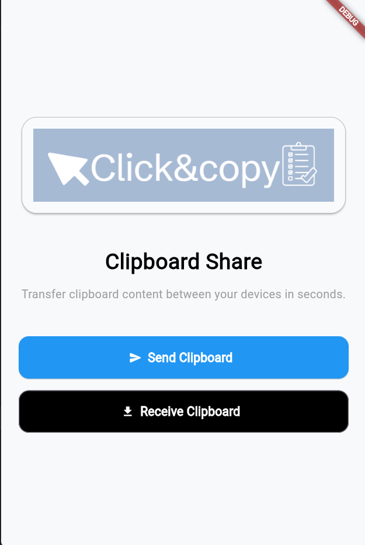
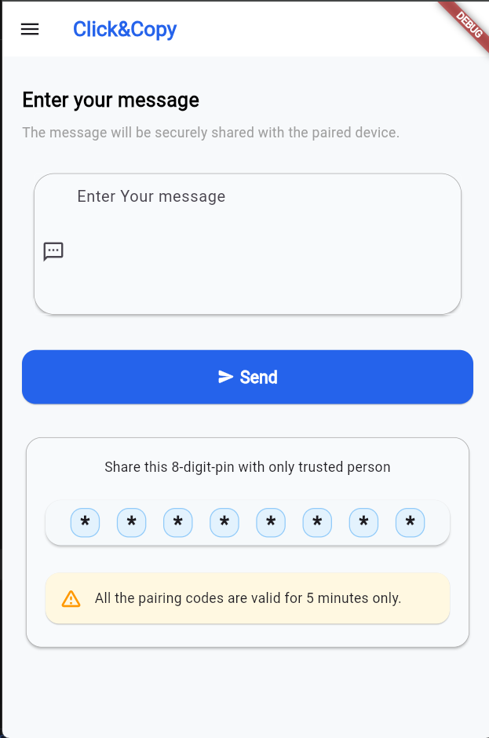
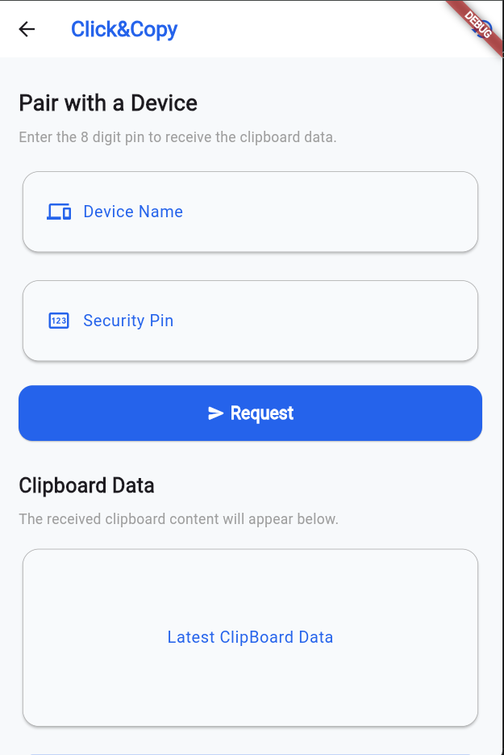
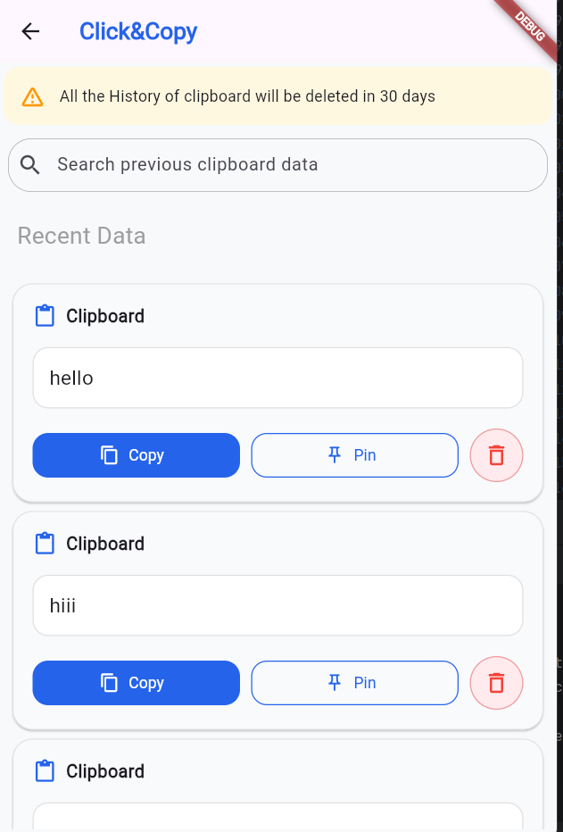

# Click&Copy 🚀

Click&Copy is a secure, real-time, cross-device clipboard sharing utility built with Flutter and Firebase. It allows you to instantly sync and transfer clipboard text between different devices using temporary, cryptographically secure 8-digit PINs generated via Time-Based One-Time Passwords (TOTP).

---

## 📸 Application Walkthrough

To view the user flow, save your screenshots inside a folder named `ScreenShots` in your repository root directory using the exact file names (`1.png`, `2.png`, etc.) as outlined below:

| 1. Connection Entry | 2. Sending Clipboard |
| :---: | :---: |
|  |  |
| **3. Receiving Live Feed** | **4. Transfer History Log** |
|  |  |

---

## ✨ Features

*   **Automated Clipboard Sniffing:** Uses Flutter's lifecycle observers (`WidgetsBindingObserver`) to automatically detect when the app returns to the foreground, copying the native device clipboard text instantly without forcing you to hit paste.
*   **Dynamic SHA-256 Room Generation:** Generates unique, secure 8-digit session keys built on a `SHA-256` hashed TOTP algorithm so rooms cannot be guessed or brute-forced.
*   **Non-Destructive Appends:** Sending multiple items within the same window uses Firebase unique push IDs (`.push().set()`). This preserves your stream history instead of wiping out your previous text nodes.
*   **Automatic 2-Minute Expiration:** Active sessions are strictly locked to a 120-second window. Once expired, local timers trigger room deletion.
*   **Self-Cleaning Architecture:** Leverages Firebase's `.onDisconnect()` hooks to instantly wipe active session data from the cloud if a sender abruptly drops connection or closes the application.

---

## 🛠️ Tech Stack & Architecture

*   **Frontend UI Engine:** Flutter & Dart
*   **Backend Services:** Firebase Realtime Database
*   **Security Protocol:** `totp_generator` (8 Digits / 120s Rotations / SHA-256)
*   **State Control:** Native Lifecycle Bindings (`AppLifecycleState`)

---

## 🚀 Getting Started

### Prerequisites
*   Flutter SDK (v3.x or higher)
*   Dart SDK
*   Firebase CLI installed and configured
   
